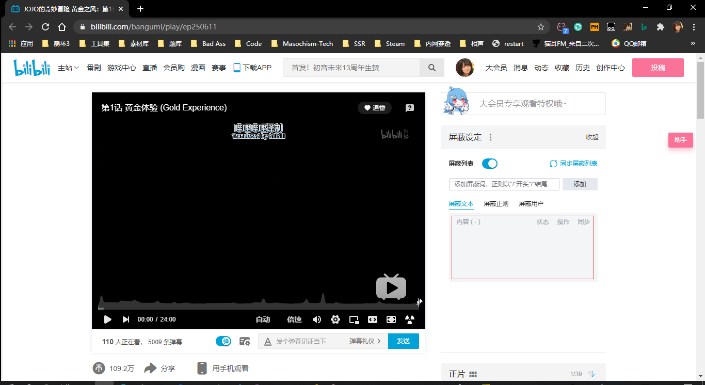

<!--
 * @Author: PlanC
 * @Date: 2020-08-31 13:54:22
 * @LastEditTime: 2020-09-18 15:53:55
 * @FilePath: \danmu_block\readme.md
-->

# Bilibili 弹幕筛选器
## thanks to 唐·吉坷德@https://blog.csdn.net/weixin_36605200/article/details/82848020

### 使用
- 请确保已安装`python3`和`pip`，或运行`install.cmd`进行安装；
- 首次使用请务必运行`init.cmd`；
- 在控制台显示`input BV (BID):`时请输入视频<sup>(未测试)</sup>或番剧的BV号，**请勿使用<kbd>Ctrl</kbd>+<kbd>C</kbd>粘贴文本，会使程序结束(非bug)，必要时请使用右键粘贴；**
    ```
    input BV (bid):BV1Ka4y1E75V
    ```
<<<<<<< HEAD
- 本程序将生成两个文件，`bilibili.xml`文件是获取到的弹幕库，`barrages_[bid].xml`文件可以直接导入至哔哩哔哩屏蔽词；
=======
- 本程序将生成两个文件，`.txt`文件用于后期生成词云，`.xml`文件可以直接导入至哔哩哔哩屏蔽词。
>>>>>>> 8d97c63ea43e14a11a5bddc67a14eb200337bc16
    ```
    bilibli.xml
    barrages_[bid].xml
    ```

### 导入

<<<<<<< HEAD
**在图中红框处右键即可打开"导入\导出"菜单，即可选中相应的xml文件进行屏蔽**
=======
**在图中红框处右键即可打开"导入\导出"菜单，即可选中相应的xml文件进行屏蔽。**

### 下载
https://github.com/iPlanC/danmu_block/releases

### TODO
添加词云提炼关键词加强屏蔽强度。

### 手机版？
因为B站网页端可以导入xml文档并同步，暂不考虑移动端。
>>>>>>> 8d97c63ea43e14a11a5bddc67a14eb200337bc16
